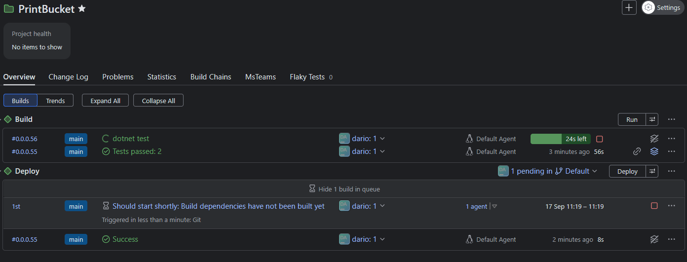

# PrintBucket

Summary
-------
PrintBucket is an application composed of a Razor Pages UI (`PrintBucket.Web`), a REST API (`PrintBucket.Api`) and AWS helper libraries (`PrintBucket.AWS`). 
It lets users create logical buckets, upload images (multiple versions) to S3 and store metadata in DynamoDB.

Demo
----
- Web UI: https://printbucket.darioparres.com
- API: https://printbucket.darioparres.com/api

Repository layout
-----------------
- `src/PrintBucket.Web` — Razor Pages frontend.
- `src/PrintBucket.Api` — REST API (upload, buckets, endpoints).
- `src/PrintBucket.AWS` — AWS services (S3, DynamoDB, utilities).
- `src/PrintBucket.Models` — shared models (Bucket, ImageRecord).
- `src/PrintBucket.Common` — common utilities (logging, etc.).
- `src/PrintBucket.Tests` — unit / integration tests.
- `packaging/`, `tools/`, `doc/` — delivery and tooling files.

Requirements
------------
- .NET 8 SDK
- Native `libvips` (required by `NetVips`) for image processing
- AWS credentials (profile, environment variables or IAM role)

Local setup
-----------
1. Clone and restore:
   - `git clone <repo>`
   - `dotnet restore`
2. AWS credentials:
   - Use `~/.aws/credentials` profile or environment variables `AWS_ACCESS_KEY_ID`, `AWS_SECRET_ACCESS_KEY`, `AWS_REGION`.
   - Optionally set `AWS:Profile` in `PrintBucket.Api/appsettings.Development.json`.
3. Configuration:
   - Set S3 and DynamoDB table names in `appsettings.Development.json`:

4. DynamoDB:
   - Create `dpi_bucket` (partition `hash_key`, sort `range_key`) or adapt `BucketService`.
   - Create `dpi_files` (e.g. partition `bucketId`, sort `id`) or adapt `ImageService`.

Run locally
-----------
- From IDE: use the launch profile in `Properties/launchSettings.json`.
- From terminal:
  - API: `dotnet run --project src/PrintBucket.Api`
  - Web: `dotnet run --project src/PrintBucket.Web`

Tests
-----
- Run tests: `dotnet test`

API Documentation & Monitoring
----------------------------

### Swagger
The API includes Swagger/OpenAPI documentation, available in development mode at:
- https://localhost:5000/swagger (when running locally)

### Metrics
Both the Web UI and API expose Prometheus-compatible metrics endpoints:

- Web UI metrics: 
  - Local: http://localhost:5000/metrics
  - Production: https://printbucket.darioparres.com/metrics

- API metrics:
  - Local: http://localhost:5003/metrics
  - Production: https://printbucket.darioparres.com/api/metrics

Available metrics include:
- HTTP request duration
- Request counts by endpoint
- Response status codes
- Active connections
- Runtime metrics (GC, thread pool, etc.)

These endpoints can be scraped by Prometheus and visualized using Grafana dashboards.

## Continuous Integration (CI)

We use an automated CI pipeline to build, test and produce artifacts for PrintBucket. The canonical CI server for this repository is:

https://buildserver.parresibarra.com

### TeamCity Environment

Project Overview:

Build Configuration:

Build Steps Detail:

Build History and Artifacts:

How it works
- On push to `main` and on pull requests the pipeline restores, builds and runs tests for all projects.
- After a successful pipeline the CI server may be notified to run further steps (packaging, deployment).
- CI secrets (tokens or webhook URLs) must be stored in your CI provider.

Deployment notes
----------------
- Configure S3 bucket policies for public access. Avoid relying on ACLs if bucket has ACLs disabled.
- Store AWS credentials securely in CI/CD (secrets manager / env vars).

Operational notes
-----------------
- Install native `libvips` on hosts used for image processing.
- Prefer bucket policies or CloudFront over object ACLs for public access.
- Serilog is configured in `PrintBucket.Common.Logging`; adjust sinks as needed.

